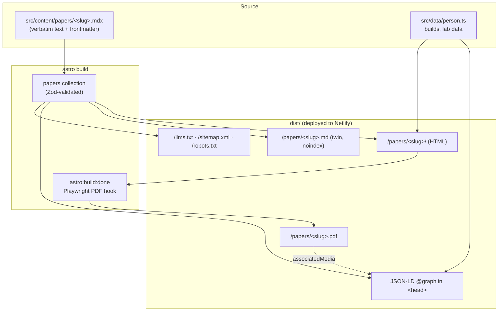

# feat: Rebuild jakeherridge.com as an AI-optimized profile site on Astro

## Summary

Replace the placeholder Eleventy site with a from-scratch Astro 5 build that positions Jake as an operations executive who ships AI. It renders his three finished white papers as full pages with auto-generated PDFs, showcases his builds and a Lab of wins and flops, and ships a visible machine-readability layer (JSON-LD, llms.txt, per-page Markdown twins, an "ask your AI" prompt pack). It keeps the Netlify pipeline and the jakeherridge.com domain, and all authored copy follows VOICE.md.

---

## Problem Frame

The full motivation lives in the origin requirements doc (see origin: `docs/brainstorms/2026-06-23-ai-profile-website-requirements.md`). In brief: Jake's decade of operations leadership, his practitioner AI writing, his shipped apps, and his internal AI systems have no home. The current site is a generic template with placeholder copy. Anyone who searches him finds nothing that represents the work, and an AI assistant asked about him has nothing credible to cite. This plan builds the home, and makes it citable by machines as a first-class feature rather than an afterthought.

---

## Key Technical Decisions

- KTD1. **Astro 5 (static output), replacing Eleventy.** Typed content collections, first-class MDX, idiomatic per-route `.md` endpoints, an `astro:build:done` integration hook for PDFs, and Cloudflare-backed longevity. It ties Eleventy on the #1 goal (both emit zero-JS static HTML that answer engines read directly) and wins on everything around it. Resolves the origin's deferred stack question.
- KTD2. **Content as typed collections with Zod schemas.** A `papers` collection schema validates every paper's frontmatter; a malformed or mis-dated paper fails the build instead of shipping. This is the safety net behind "drop in a finished paper without rework."
- KTD3. **Markdown twins via per-route `.md` endpoints, served `noindex`.** Research shows the `.md` twin is the strongest "ask your AI" substrate (agents parse it far more efficiently than HTML). `noindex` on `*.md` prevents the twins from competing with the canonical HTML in search. Serving the full paper text as open plaintext is the intended tradeoff for AI-readability; `noindex` is a crawler hint, not access control.
- KTD4. **JSON-LD as one `@graph`: Person + WebSite cross-linked by `@id`, papers as `TechArticle`, apps as `SoftwareApplication`.** `Person.sameAs` ties LinkedIn and GitHub to the site, which is the biggest lever for accurate citation of a person. `TechArticle` fits practitioner white papers; `ScholarlyArticle` would mismatch (it signals peer-reviewed academic work). `SoftwareApplication` (apps) and `BreadcrumbList` (nested pages) extend the origin's Person/Article set as deliberate, low-cost AEO additions.
- KTD5. **Build-time PDFs via Playwright in the `astro:build:done` hook, run during the Netlify build, with a dedicated print stylesheet.** Keeps PDFs in sync automatically, renders the SVG charts at full fidelity, and produces public PDFs (which Perplexity prioritizes). PDFs link back from schema `associatedMedia`. Fallback if the Netlify build proves heavy: a standalone `npm run pdf` step run in CI.
- KTD6. **Tailwind v4 via the `@tailwindcss/vite` plugin; drop the Tailwind CDN.** Origin-served, purged, minified CSS, no render-blocking external script, one fewer CSP allowance.
- KTD7. **Static Netlify deploy with native HTML Netlify Forms + honeypot.** No backend. The same-origin POST needs only `form-action 'self'` added to the CSP. Drop the placeholder site's SPA `/* -> /index.html` 404 rule (a static-site footgun) and add a real 404 page.
- KTD8. **Single light-first editorial theme, no dark/light toggle.** Simpler, paper-forward, less to maintain. Personality comes from type, accent color, and restrained motion.
- KTD9. **Manual paper curation, not an automated sync.** The WhitePapers workspace holds many non-final files (multiple draft versions, research notes). The finished text is copied in deliberately (06 `draft-v3`, 03 `draft-v2`, 04 `draft-v2`), preserving editorial control and the author's verbatim text.

---

## High-Level Technical Design

Each paper is one source file that fans out to every surface a reader or an agent might want. The build turns content into HTML, a Markdown twin, a PDF, and structured data, plus three site-wide machine-readable files.



Site map: `/` (home), `/about/`, `/papers/` + `/papers/<slug>/`, `/work/` (builds), `/lab/`, `/contact/` + `/thanks/`, `/ai/` (the "ask your AI" colophon), `/404`. Generated: `/llms.txt`, `/sitemap.xml`, `/robots.txt`, and `/papers/<slug>.md` + `/papers/<slug>.pdf` per paper.

---

## Output Structure

```text
jakeherridge/
  astro.config.mjs            # integrations: mdx, sitemap; @tailwindcss/vite; PDF integration
  package.json                # astro, @astrojs/mdx, @astrojs/sitemap, tailwindcss, playwright
  tsconfig.json
  .nvmrc                      # Node 20
  .gitignore                  # node_modules/, dist/
  netlify.toml                # build cmd, redirects (preserved), CSP, *.md noindex
  integrations/
    pdf.mjs                   # astro:build:done -> Playwright print-to-PDF
  src/
    content.config.ts         # papers (+ builds, lab) collection schemas
    content/
      papers/
        from-dashboards-to-decisions.mdx
        compute-then-narrate.mdx
        abundance-or-scarcity.mdx
    data/
      person.ts               # Person facts, sameAs, builds, lab entries
    layouts/
      BaseLayout.astro
      PaperLayout.astro
    components/
      Header.astro  Footer.astro  Seo.astro  JsonLd.astro
      Hero.astro  Card.astro  Email.astro
      AskYourAI.astro  CopyButton.astro   # CopyButton = the one tiny island
    pages/
      index.astro  about.astro  contact.astro  thanks.astro  ai.astro  404.astro
      work/index.astro   lab/index.astro
      papers/index.astro  papers/[...slug].astro
      papers/[...slug].md.ts          # Markdown twin endpoint
      llms.txt.ts  robots.txt.ts      # generated files (sitemap via integration)
    styles/
      global.css   print.css
    assets/
      papers/breakeven-chart.svg  abundance-curve.svg
      jake-professional.jpg  jake-candid.jpg   # provided by Jake; placeholders until then
  public/
    favicon.svg  og-default.png  site.webmanifest
  tests/
    papers.test.ts  ai-readability.test.ts  contact.test.ts  build-output.test.ts
```

The per-unit `**Files:**` lists are authoritative; this tree is the scope-shape declaration.

---

## Requirements

Carried from the origin doc (R1-R19) and grouped by concern, plus plan-level requirements (R20-R23).

**Content and structure**
- R1. The hero states Jake's positioning in his voice and surfaces the headline proof stat ($22M to $75M, 180 to 550+ engineers, flat internal headcount).
- R2. An About narrative tells Jake's story in VOICE.md voice (EE plus MBA, the LER TechForce decade, the AI-champion work, the through-line), names LER TechForce and Cummins, and carries a light human note (Bentonville, family) with no children's names.
- R3. The site is multi-page with stable, human-readable URLs per paper and per major section.
- R4. The old blog, "thought of the day," links model, and Decap/Netlify CMS admin are gone.

**White papers**
- R5. The three finished papers (03 Compute, Then Narrate; 04 Abundance or Scarcity; 06 From Dashboards to Decisions) each render as a full reading page on its own URL.
- R6. Each finished paper offers a PDF download of the same content.
- R7. Paper 04's two SVG charts render with the paper.
- R8. No unfinished or draft paper is shown or teased anywhere.
- R9. The papers index is built so a newly finished paper is added as a full page plus PDF without structural rework.

**Builds and Lab**
- R10. A Builds area features PocketWild, the APD storytelling system (GitHub), and KitchenHappy, each linked.
- R11. Internal AI work (the AI Hub, the 2,000-hour-per-cycle review system, Anthropic API tools, Claude Code automations) appears as described results, not demos or screenshots.
- R12. A Lab section owns wins and honest flops, each with its lesson, in Jake's voice.

**AI-readability**
- R13. The site serves llms.txt, emits a JSON-LD `@graph` (Person, WebSite, an Article per paper, apps), uses clean semantic HTML with per-page metadata, and a visible "ask your AI about my work" prompt pack.

**Contact**
- R15. The contact path offers a working Netlify form, a LinkedIn link, and an email button; the phone number never appears; the email resists trivial scraping.
- R16. Contact framing is neutral, with no availability or job-search language anywhere.

**Voice, design, delivery**
- R17. All authored copy follows VOICE.md, including the no-em-dash and no-en-dash rule.
- R18. The visual direction is a single editorial theme with playful accents, paper-forward.
- R19. The site deploys on the existing Netlify pipeline at jakeherridge.com, preserving the HTTPS and www-to-apex redirects.

**Plan-level**
- R20. The site ships no client-side JavaScript to render content; the only interactivity is an isolated copy-to-clipboard island that degrades gracefully.
- R21. Markdown twins (`*.md`) are served with `X-Robots-Tag: noindex` so they never compete with the canonical HTML in search.
- R22. `node_modules/` and the build output are untracked and gitignored (the current repo commits both).
- R23. Paper text is preserved verbatim from the author's finished drafts; only new copy (hero, About, Builds, Lab) is authored to VOICE.md.

(R14 from origin folds into R13's "ask your AI" clause and is delivered by U11.)

---

## Implementation Units

### Phase 1 — Foundation and design

### U1. Scaffold the Astro project and retire the Eleventy site
- **Goal:** A clean Astro 5 project that builds, with the placeholder Eleventy app and committed dependencies removed.
- **Requirements:** R4, R22.
- **Dependencies:** none.
- **Files:** create `package.json`, `astro.config.mjs`, `tsconfig.json`, `.nvmrc`, `.gitignore`; delete `.eleventy.js`, `src/_data/`, `src/_includes/`, `src/index.njk`, `src/about.njk`, `src/ideas.njk`, `src/links.njk`, `src/posts/`, `admin/`; untrack `node_modules/` and `_site/`.
- **Approach:** Astro static output (no SSR adapter). Add integrations `@astrojs/mdx` and `@astrojs/sitemap`, and `@tailwindcss/vite`. Pin `astro` to `^5` (e.g. `^5.18.0`) explicitly in `package.json`, since `astro@latest` now resolves to 7.x (which requires Node 22+) and would break the Node 20 build. Pin Node 20 in `.nvmrc`. `.gitignore` covers `node_modules/`, `dist/`, `_site/`; remove the 3,126 tracked `node_modules` files and the committed `_site/` in this unit.
- **Patterns to follow:** preserve `netlify.toml` for now (rewritten in U13); keep `src/img/headshot.jpg` as a candidate asset.
- **Test scenarios:** `Test expectation: none -- scaffolding/config.` Verified by a clean `astro build` producing `dist/index.html` and by `git ls-files` no longer listing `node_modules/`.
- **Verification:** `astro build` succeeds; repo no longer tracks dependencies or build output.

### U2. Design system and base layout
- **Goal:** A single editorial theme (type scale, color tokens, spacing, restrained motion) and the semantic base layout every page extends.
- **Requirements:** R18, R20.
- **Dependencies:** U1.
- **Files:** `src/styles/global.css`, `src/layouts/BaseLayout.astro`, `src/components/Header.astro`, `src/components/Footer.astro`, `src/components/Seo.astro`, `public/favicon.svg`, `public/site.webmanifest`, `tests/build-output.test.ts`.
- **Approach:** Tailwind v4 CSS-first (`@import "tailwindcss";` plus an `@theme` token block) in `global.css`. `BaseLayout` renders the document shell with semantic landmarks (`header`/`main`/`footer`), a skip link, the `Seo` component (title, description, canonical, OpenGraph, Twitter), and a slot for per-page JSON-LD. No content depends on client JS. Editorial direction (starting point, refine during build, do not default to a generic SaaS look): a serif display face for headings and paper titles paired with a clean humanist sans for body and UI; one restrained accent color; generous whitespace and a measured reading column; motion limited to small, fast transitions. Define one `:focus-visible` rule in `global.css` (a 2px accent outline, 2px offset) applied to every interactive element.
- **Patterns to follow:** light-first palette; carry a restrained accent. Keep the document shell free of inline framework scripts.
- **Test scenarios:** Covers R20. Build a page and assert the rendered HTML contains `lang`, a non-empty `<title>`, a meta description, a canonical link, and OG tags; assert no `<script>` tag is required to render body content (the only scripts allowed are `type="application/ld+json"` and the deferred copy-island in U11).
- **Verification:** Pages render with consistent type and spacing; Lighthouse/axe shows no critical a11y violations on the base layout.

### Phase 2 — White papers and PDFs

### U3. Papers content collection, paper layout, and index
- **Goal:** A typed `papers` collection, the per-paper page route, and the published-only index.
- **Requirements:** R3, R5, R8, R9.
- **Dependencies:** U2.
- **Files:** `src/content.config.ts`, `src/layouts/PaperLayout.astro`, `src/pages/papers/[...slug].astro`, `src/pages/papers/index.astro`, `tests/papers.test.ts`.
- **Approach:** Zod schema with `title`, `date`, `description`, `status` (`draft | published`), and optional `paperNumber`. The page route uses `getStaticPaths` over `getCollection('papers')` filtered to `status === 'published'`; the index lists published papers newest-first. `PaperLayout` renders a visible author byline and `datePublished` / `dateModified` (freshness aids citation) and a "Download PDF" link. The index entry shows title, date, and description in a consistent treatment; an empty collection renders a brief placeholder line rather than a blank list.
- **Patterns to follow:** Astro Content Collections `glob` loader; drop-in a new `.mdx` file requires no code change.
- **Test scenarios:**
  - Covers AE1. A new published `.mdx` dropped into the collection appears at `/papers/<slug>/` and in the index with no code change.
  - Covers R8. A paper with `status: draft` neither renders a page nor appears in the index.
  - The schema rejects a paper missing `title` or `date` (build fails) -- the malformed-paper safety net.
  - The index orders published papers newest-first and shows title, date, and description.
- **Verification:** The three published papers (after U4) resolve at clean URLs; drafts are absent.

### U4. Curate and import the three finished papers
- **Goal:** The three finished drafts become site-ready MDX, text preserved verbatim, with paper 04's charts.
- **Requirements:** R5, R7, R23.
- **Dependencies:** U3.
- **Files:** `src/content/papers/from-dashboards-to-decisions.mdx`, `src/content/papers/compute-then-narrate.mdx`, `src/content/papers/abundance-or-scarcity.mdx`, `src/assets/papers/breakeven-chart.svg`, `src/assets/papers/abundance-curve.svg`.
- **Approach:** Import 06 `draft-v3`, 03 `draft-v2`, 04 `draft-v2` from Jake's WhitePapers workspace (external to this repo). Add frontmatter (`title`, `date`, `description`, `status: published`); keep body text verbatim. Embed paper 04's two SVGs inline via MDX at their referenced positions. Each chart SVG carries a `<title>` (descriptive name) and `<desc>` (one-line data summary) as its first children, with `role="img"` and `aria-labelledby` referencing them, so screen-reader users get the quantitative content.
- **Execution note:** Preserve the author's text verbatim. Do not rewrite, summarize, or "improve" paper prose; only add frontmatter and place the charts.
- **Test scenarios:** All three papers build and render; paper 04 displays both charts; each chart SVG carries a non-empty `<title>`; a scan of the three files finds no em dashes or en dashes (the source already follows this rule -- confirm import did not introduce any).
- **Verification:** Each paper reads correctly end-to-end against its source draft.

### U5. Build-time PDF generation
- **Goal:** A PDF per paper, generated at build, matching the site's print look.
- **Requirements:** R6.
- **Dependencies:** U4.
- **Files:** `integrations/pdf.mjs`, `src/styles/print.css`, `astro.config.mjs` (register the integration), `package.json` (Playwright).
- **Approach:** An Astro integration on `astro:build:done` serves `dist/` with Node's built-in `http.createServer` on an ephemeral port (no new dependency), loads each `http://127.0.0.1:<port>/papers/<slug>/` with Playwright, writes `dist/papers/<slug>.pdf` via `page.pdf()`, and closes the server in a `finally` block. Avoid `file://`, which breaks the absolute asset and CSS paths the print stylesheet needs. `print.css` (loaded for print) hides nav/footer, sets `@page` margins, and forces chart figures to avoid page breaks. On Netlify, install Chromium in the build (`npx playwright install --with-deps chromium`) ahead of `astro build`.
- **Test scenarios:**
  - Covers R6. After a build, each `/papers/<slug>.pdf` exists and is non-empty.
  - Extracted PDF text contains the paper's title and a known sentence from its body.
  - The print stylesheet removes site chrome (no nav/footer text in the PDF).
- **Verification:** Three PDFs build locally; a new paper added in the future also yields a PDF with no extra wiring.

### Phase 3 — Content pages

### U6. Home page
- **Goal:** A hero that lands the positioning, the proof stat, and the two-photo treatment, with section teasers and a neutral CTA.
- **Requirements:** R1, R16, R17.
- **Dependencies:** U2.
- **Files:** `src/pages/index.astro`, `src/components/Hero.astro`, `src/assets/jake-professional.jpg`, `src/assets/jake-candid.jpg`.
- **Approach:** Hero pairs the polished and candid photos (art-directed contrast) with the positioning line and the flat-headcount stat. Below ~640px, show only the professional photo at full width (the candid is `aria-hidden` but kept in the DOM for LCP) with the copy beneath; at ~640px and up, both photos sit side by side. Teasers link to Papers, Builds, Lab. A single neutral CTA ("Get in touch") points to `/contact/`. Photos are placeholders with a visible TODO until Jake provides them.
- **Execution note:** All copy follows VOICE.md.
- **Test scenarios:** Covers R1. The hero renders the positioning line and the proof stat; the CTA resolves to `/contact/`; no availability or "open to work" language appears (Covers R16).
- **Verification:** Home reads as "operator who ships AI" at a glance; photos slot in without layout change when provided.

### U7. About page
- **Goal:** Jake's story, in voice.
- **Requirements:** R2, R17.
- **Dependencies:** U2.
- **Files:** `src/pages/about.astro`.
- **Approach:** Narrative covering EE plus MBA (Harding), the LER TechForce decade, the AI-champion work, and the through-line (find the big idea in the day-to-day, use AI to free people for the interesting human work). Names LER TechForce and Cummins. A short, warm Bentonville/family note with no children's names.
- **Execution note:** Copy follows VOICE.md; practitioner "I", no confessional register, no em/en dashes.
- **Test scenarios:** Covers R2. The page names LER TechForce, Cummins, and Harding, states the through-line, includes no children's names, and contains no em/en dashes.
- **Verification:** Reads as one voice with the rest of the site.

### U8. Builds and Lab pages
- **Goal:** The proof-of-work showcase and the wins-and-flops narrative.
- **Requirements:** R10, R11, R12, R17.
- **Dependencies:** U2.
- **Files:** `src/pages/work/index.astro`, `src/pages/lab/index.astro`, `src/components/Card.astro`, `src/data/person.ts` (builds + lab entries).
- **Approach:** Builds features PocketWild (link), APD (GitHub link), KitchenHappy (link), and a "Built inside the business" group describing the AI Hub, the 2,000-hour review system, the Anthropic API tools, and the Claude Code automations as results, with no screenshots. Lab lists wins (PocketWild, the internal tools, helping Haley) and flops (the 3D image generator, the color-palette/wardrobe tool, the SOC-code/wage generator), each with its one-line lesson. Builds/Lab entries live as typed data in `person.ts` so U9 can emit `SoftwareApplication` JSON-LD from the same source.
- **Execution note:** Copy follows VOICE.md.
- **Test scenarios:** Covers R10, R11, R12. Builds links to the three external properties and shows the internal work without demo/screenshot assets; Lab shows at least the three named flops, each with a lesson, alongside the wins.
- **Verification:** Both pages read in voice and link out correctly.

### Phase 4 — AI-readability layer

### U9. Structured data (JSON-LD @graph)
- **Goal:** One structured-data graph that ties Jake's identity and work together for answer engines.
- **Requirements:** R13.
- **Dependencies:** U3, U5, U8.
- **Files:** `src/components/JsonLd.astro`, `src/data/person.ts`, wired into `BaseLayout.astro` and `PaperLayout.astro`, `tests/ai-readability.test.ts`.
- **Approach:** A site-wide `@graph` with `Person` (`@id`, `name`, `url`, `image`, `jobTitle`, `worksFor`, `alumniOf: Harding`, `knowsAbout`, and `sameAs` to LinkedIn + GitHub) and `WebSite`, cross-referenced by `@id`. Each paper emits a `TechArticle` with `author`/`publisher` by `@id`, `datePublished`/`dateModified`, `mainEntityOfPage`, and `associatedMedia` pointing to its PDF. Apps emit `SoftwareApplication` from the `person.ts` data. Nested pages emit `BreadcrumbList`.
- **Patterns to follow:** inline `<script type="application/ld+json">` (allowed by the current CSP's `script-src 'unsafe-inline'`).
- **Test scenarios:**
  - Covers AE2 (partial). The Person graph parses as valid JSON-LD and its `sameAs` includes the LinkedIn and GitHub URLs.
  - Each paper page emits `TechArticle` (not `ScholarlyArticle`) with `author` referencing the Person `@id` and `associatedMedia` pointing to the paper's `.pdf`.
  - App entries emit `SoftwareApplication` with `name`, `applicationCategory`, and `author`.
- **Verification:** Google Rich Results Test and `validator.schema.org` pass for the home page and a paper page.

### U10. Generated machine-readable files and Markdown twins
- **Goal:** llms.txt, sitemap, robots, and a `.md` twin per paper, served so they help agents without hurting search.
- **Requirements:** R13, R21.
- **Dependencies:** U3.
- **Files:** `src/pages/llms.txt.ts`, `src/pages/robots.txt.ts`, `src/pages/papers/[...slug].md.ts`, `astro.config.mjs` (sitemap integration), `netlify.toml` (the `*.md` noindex header is added in U13), `tests/ai-readability.test.ts`.
- **Approach:** `llms.txt` is a small (<5KB) curated index: an H1 of Jake's name, a one-paragraph blockquote summary, then sectioned links (Writing, Builds, About, Contact) including the `.md` twin URLs. `robots.txt` keeps the default allow-all baseline (no blanket `Disallow: /`), adds explicit `Allow` directives for the citation-capable bots (GPTBot, ChatGPT-User, OAI-SearchBot, PerplexityBot, ClaudeBot, anthropic-ai, Google-Extended, Bingbot) as a cooperative signal rather than a strict allowlist, optionally disallows CCBot (training-only), and points to the sitemap. The `.md` twin endpoint pre-renders one `text/markdown` file per paper carrying the clean body, coalescing an empty body to `''` so a frontmatter-only stub never serializes the literal string `undefined`. `@astrojs/sitemap` emits `sitemap.xml`. Skip `llms-full.txt` (the site is under the threshold where it helps).
- **Test scenarios:**
  - Covers AE2. `GET /papers/<slug>.md` returns `text/markdown` containing the paper body; `GET /llms.txt` returns the curated index under 5KB with the paper links.
  - `robots.txt` allows the named AI bots and references `/sitemap.xml`.
  - `sitemap.xml` lists the public HTML pages and excludes the `.md`/`.pdf` artifacts.
- **Verification:** The four artifacts build to `dist/`; the `.md` twins carry `noindex` once U13 lands the header.

### U11. "Ask your AI about my work" feature
- **Goal:** Make the machine-readability visible and usable, on brand.
- **Requirements:** R13.
- **Dependencies:** U10.
- **Files:** `src/components/AskYourAI.astro`, `src/components/CopyButton.astro`, `src/pages/ai.astro`, placements on home/about/paper pages.
- **Approach:** A small section, plus an `/ai/` colophon page ("this site is built to be read by your AI") that realizes the user-confirmed "built to be read by machines" showpiece (origin R14 plus the higher-upside idea Jake green-lit during brainstorming). Both present a copy-paste prompt pack and "View as Markdown" / "Copy for AI" links to the `.md` twins and `llms.txt`. `CopyButton` is the single client-side island (Astro `client:visible`): on success its label shows "Copied" for ~2s then reverts; on a clipboard failure it reveals the text pre-selected for manual copy; both states use the U2 accent and type tokens. Everything works without JS (the links resolve plainly).
- **Test scenarios:**
  - Covers F3. The prompt pack renders; "View as Markdown" links resolve to the `.md` twins; the `llms.txt` link resolves.
  - With JavaScript disabled, the section still renders and all links work (the copy button is the only thing that no-ops).
- **Verification:** A visitor can copy a prompt and a context URL and get a useful answer from their own assistant.

### Phase 5 — Contact and deploy

### U12. Contact form and thanks page
- **Goal:** A working, low-friction contact path with no phone exposure.
- **Requirements:** R15, R16.
- **Dependencies:** U2.
- **Files:** `src/pages/contact.astro`, `src/pages/thanks.astro`, `src/components/Email.astro`, `tests/contact.test.ts`.
- **Approach:** A native HTML form with `data-netlify="true"`, `netlify-honeypot="bot-field"`, a hidden `form-name`, and `action="/thanks/"`; required fields use the native `required` attribute (no JS validation), and Netlify's automatic Akismet backs the honeypot (add hCaptcha later only if spam grows). The `/thanks/` page confirms in VOICE.md voice and links back home; the contact page carries a fallback line ("if the form misbehaves, use the email button"). Alongside the form: a LinkedIn link and an email button via `Email.astro`, which assembles the address only on user interaction so no full address string sits in the served HTML or JS bundle. No phone number. Framing is a neutral invitation.
- **Test scenarios:**
  - Covers AE3. No page contains availability or "open to work" language; the contact page offers only a neutral invitation.
  - The form carries `data-netlify`, the honeypot field, and the hidden `form-name`; `action` is `/thanks/`.
  - The served HTML contains no plaintext phone number and no raw `mailto:` address.
- **Verification:** A test submission appears in Netlify Forms and redirects to `/thanks/`.

### U13. Netlify config and final hardening
- **Goal:** A correct production deploy: build command, redirects, CSP, 404, and headers.
- **Requirements:** R19, R21.
- **Dependencies:** U1, U5, U10, U12.
- **Files:** `netlify.toml`, `src/pages/404.astro`, `public/og-default.png`.
- **Approach:** Build command installs Chromium then runs `astro build`; publish `dist/`. Preserve the four domain redirects (HTTPS force, www to apex). Remove the SPA `/* -> /index.html` 404 rule and add a real `404.astro`. Update the CSP: drop `cdn.tailwindcss.com`, `unpkg.com`, and `identity.netlify.com` (CMS and CDN are gone); remove `'unsafe-eval'` (nothing needs it now) and replace `script-src 'unsafe-inline'` with SHA-256 hashes for the inline JSON-LD blocks; add `form-action 'self'`, `frame-ancestors 'none'`, and `base-uri 'self'` (and drop the now-redundant `X-Frame-Options`); add a font host only if web fonts are used. Add `X-Robots-Tag: noindex` for `/*.md`. Add a favicon and a real default OG image.
- **Test scenarios:**
  - Covers R21. A request for a `.md` twin returns `X-Robots-Tag: noindex`.
  - The CSP contains `form-action 'self'` and no longer lists the Tailwind CDN, unpkg, or Netlify Identity.
  - A request to a nonexistent path serves the real 404 page (not the homepage body).
  - The HTTPS and www-to-apex redirects still resolve.
- **Verification:** A Netlify deploy preview builds (PDFs included), forms work, redirects hold, and the 404 is correct.

---

## Acceptance Examples

Carried from the origin doc; each is enforced by the cited unit's test scenarios.

- AE1. Adding a finished paper. **Given** the three finished papers are live, **when** Jake finishes a fourth, **then** it is added as a full page plus PDF and appears in the papers index with no redesign. **Enforced by:** U3, U5.
- AE2. AI crawl. **Given** an AI agent requests `/llms.txt`, **when** it follows the links, **then** it reaches full-text paper pages, `.md` twins, and a Person/Article graph that let it attribute Jake's work correctly. **Enforced by:** U9, U10.
- AE3. No availability signal. **Given** any page, **when** a reader looks for availability language, **then** none exists, only a neutral invitation. **Enforced by:** U6, U12.
- AE4. Voice check. **Given** any authored copy, **when** it is scanned for em or en dashes, **then** there are none. **Enforced by:** U4, U6, U7, U8.

---

## Risks & Dependencies

- **Chromium in the Netlify build (PDF).** Installing Playwright's Chromium lengthens builds and can break on image changes. Mitigation: pin the Playwright version; if Netlify builds become flaky or slow, fall back to KTD5's standalone `npm run pdf` in CI and commit/upload the PDFs. (Risk owner: U5, U13.)
- **Astro major-version drift.** Astro 7.x is now latest and requires Node 22+, and `astro@latest` will pull it. Pin `astro` to `^5` and keep the Node 20 floor so the build stays on the 5.x line. (U1.)
- **Tailwind v4 with the Vite plugin.** v4 is CSS-first and config-light; confirm the `@tailwindcss/vite` path on the pinned Astro version. (U2.)
- **`.md` twin search dilution.** Without the `noindex` header the twins can suppress the canonical pages. The header in U13 is load-bearing, not optional. (U10, U13.)
- **Fonts in the PDF build.** If a web font is used, it must be available in the build image or PDFs fall back silently. Embed/self-host fonts or stick to system fonts for print. (U5.)
- **Pending assets from Jake.** The two hero photos are provided by Jake; until then the hero uses placeholders. Not a blocker for any other unit. (U6.)
- **External source content.** Paper text comes from Jake's WhitePapers workspace, outside this repo; U4 is a one-time manual import per paper. (U4.)

---

## Scope Boundaries

**Deferred for later** (carried from origin)
- Additional papers as each is finished; the other four are not on the site yet.
- A possible "Writing" corner for personal essays and poems.
- The CPG margin tool as a future Lab entry if Jake decides it belongs there.
- An interactive calculator widget for paper 04 (charts ship static).

**Outside this product's identity** (carried from origin)
- Any job-search or availability signaling.
- The phone number, or any contact channel beyond form, LinkedIn, and email.
- Demos, screenshots, or source of internal or proprietary tools (described results only, per the public-or-synthetic-only ethic).
- A blog or frequently-updated content feed.

**Deferred to follow-up work** (plan-local)
- `llms-full.txt` and the OKF `/okf/` bundle (below the threshold where they help today; revisit if the writing corpus grows).
- Bing Webmaster Tools submission and Brave Search visibility checks (off-site AEO, post-launch).
- An automated paper-ingestion pipeline (manual curation is correct at three papers).

---

## Open Questions

- **Hero photos.** Treatment is decided (professional paired with candid); Jake provides the two image files. Implementation proceeds with placeholders. Deferred to implementation, not blocking.
- **Final source draft per paper.** Plan assumes 06 `draft-v3`, 03 `draft-v2`, 04 `draft-v2` are the finished text. Confirm at import (U4) if a newer draft exists.

---

## Documentation / Operational Notes

- **Netlify build settings.** Update the build command to install Chromium then `astro build`; publish `dist/`. Set `NODE_VERSION` to 20.
- **Enable Netlify Forms.** Form detection must be turned on in the Netlify UI for the contact form to capture submissions. Submissions (name, email) are stored by Netlify with no auto-expiry; export and clear them periodically.
- **Adding a future paper (runbook).** Drop a new `.mdx` into `src/content/papers/` with `status: published` and valid frontmatter; the page, index entry, `.md` twin, PDF, sitemap entry, llms.txt entry, and JSON-LD all follow from the build. No code change.
- **Capture learnings.** This repo has no `docs/solutions/` yet; after the non-obvious pieces land (the PDF hook, the `.md` twin pattern, the CSP/forms wiring), capture them with `/ce-compound`.

---

## Sources / Research

- Origin requirements: `docs/brainstorms/2026-06-23-ai-profile-website-requirements.md`. Voice authority: Jake's `VOICE.md` (external WhitePapers workspace).
- Framework choice: [Astro vs Eleventy/Hugo for content + AI sites, 2026](https://blog.saurav.io/best-static-blogging-stacks-ai-development-2026/); [Astro joins Cloudflare](https://astro.build/blog/joining-cloudflare/); [Astro Content Collections](https://docs.astro.build/en/guides/content-collections/); [Astro MDX](https://docs.astro.build/en/guides/integrations-guide/mdx/).
- AI-readability: llms.txt honest state ([Presenc](https://presenc.ai/research/state-of-llms-txt-2026), [limy.ai](https://limy.ai/blog/llms.txt-in-2026-the-full-guide)); GEO/AEO (Princeton GEO study; cite-sources and freshness levers); markdown-for-agents pattern ([VS Magazine, Feb 2026](https://visualstudiomagazine.com/articles/2026/02/24/in-agentic-ai-its-all-about-the-markdown.aspx)).
- Schema: `TechArticle` for practitioner white papers, not `ScholarlyArticle` ([article-vs-blogposting](https://schemavalidator.org/guides/article-vs-blogposting-schema), [schema.org/TechArticle](https://schema.org/TechArticle)); `@graph` + Person `sameAs` for entity disambiguation.
- PDF: Playwright print-to-PDF as the fidelity/CI default ([benchmark 2026](https://pdf4.dev/blog/html-to-pdf-benchmark-2026)); the `eleventy-plugin-prince-pdf` "serve dist then print" architecture as a wiring reference.
- Astro mechanics: `@astrojs/sitemap`, `llms.txt` endpoint pattern ([scalabledeveloper](https://scalabledeveloper.com/posts/llms-txt-with-astro/)), Tailwind v4 via `@tailwindcss/vite`.
- Netlify: native HTML [Forms setup](https://docs.netlify.com/manage/forms/setup/) and honeypot; CSP needs `form-action 'self'`.
- Existing repo: `netlify.toml` (redirects + CSP to preserve/trim; the SPA-404 footgun), `package.json` (Eleventy 2.0.1), committed `node_modules/` and `_site/` to untrack, unused `src/img/headshot.jpg`.
